# Awesome Olive

Awesome Olive is the first level of a game created with the Unreal Engine 4.13.2, 3D Studio MAX 2015, and Adobe PhotoShop CC 2015.

# Overview

```sh
> Olive, a right-handed machine, sets off into a adventure to rescue a close friend that has been captured by a Invader. 
> He struggles to save his friend in the Invader's Den with his colleagues whom he met during his long journey.
```
  - This game follows the classical arcade game style, where a player can run, jump, gain points, fights with enemies, and proceeds to the next level by achieving goals.
  - This level shows the first level of the game, right after the intro cinematic and tutorial level.

# Game Characters and Items


| Character | Name | Description |
| ------ | ------ | ------ |
| 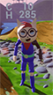 | Hero | Main Character|
| 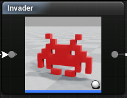 | Red Invader | Enemy |
| 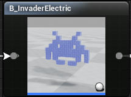 | Electric Invader | Enemy |
| 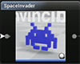 |  Space Invader| Enemy |
| 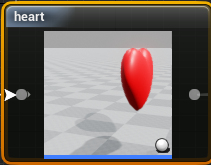 | heart | Item for heath increasing |
| 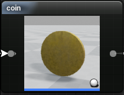 | coin | Item |
| 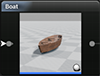 |   boat | Item|

# Game Play

  - Press the F key to use the firearm and remove the three electric invaders.
  - When you see the message that you can launch the boat, board the boat.  - 
  - All missions must be completed within 600 seconds of the start of the game.
  - Fire and Invader contact drops health.
  - When you fall into deep water, health drops to 0 and the game ends.

You will also:
  - visit the wooden bridge, the switch is newly turned on, then the electric invader reappears so you can try the hunt for the invader multiple times.

# Control
| Key | Movement |
| ------ | ------ |
| W | Forward |
| A | Left |
| D | Right |
| X | Backward |
| F | Fire |
| SpaceBar | Jump |
| Left Mouse Button + Drag |   Viewing direction   |


### Tech
* Level
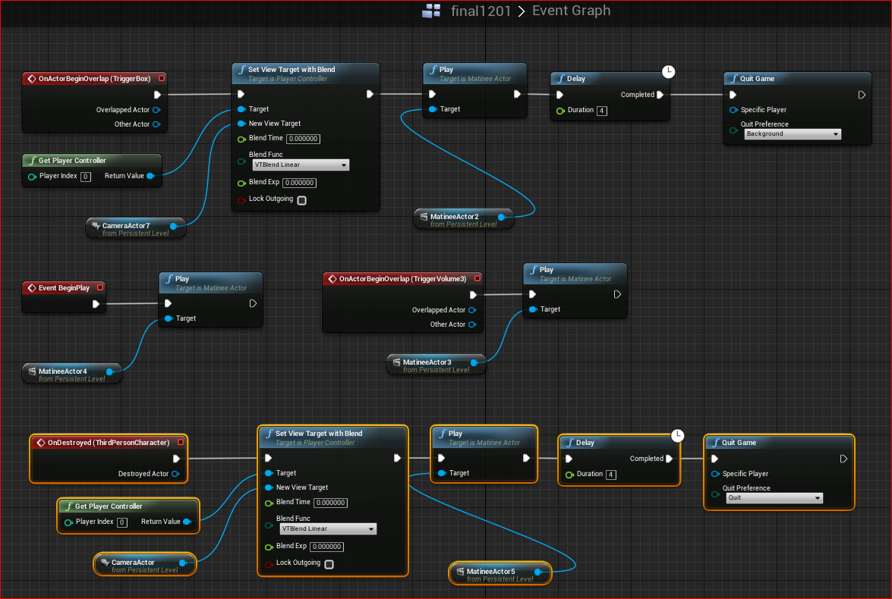
* Character
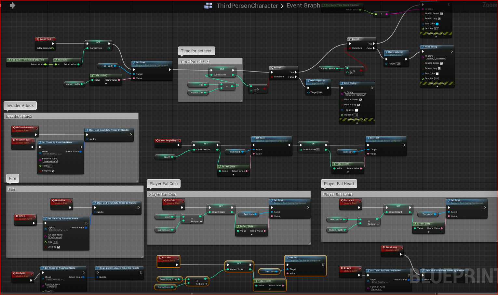
* Item - coin
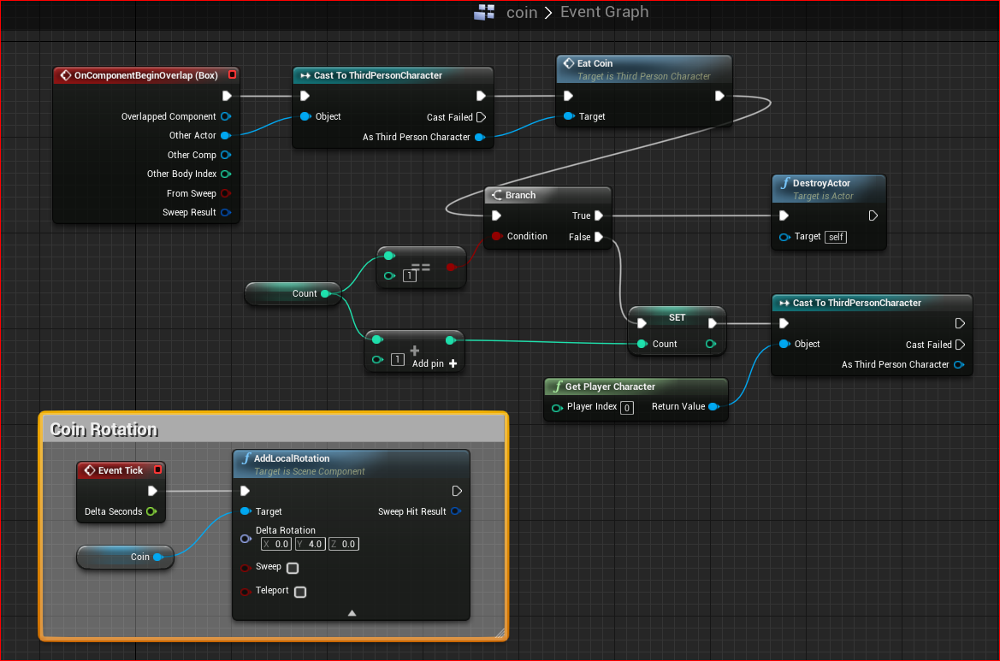
* Item - bullet
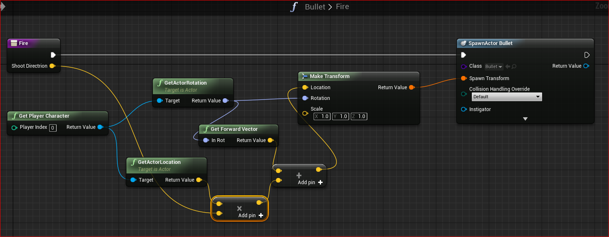
* Enemy - fire
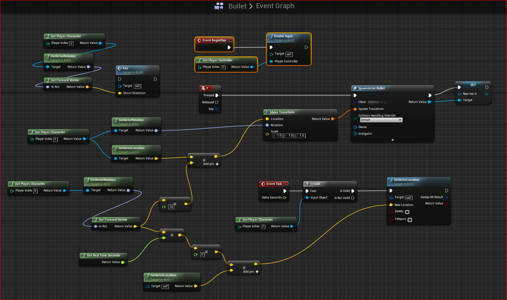


###  References
* Used free Background from Unreal Marketplace 
* Used free sample Heart, Invader, Boat from http://tf3dm.com/3d-models/unreal
* Used *.wav samples

#### Unreal

Visit [unrealengine site](https://www.unrealengine.com/what-is-unreal-engine-4)
